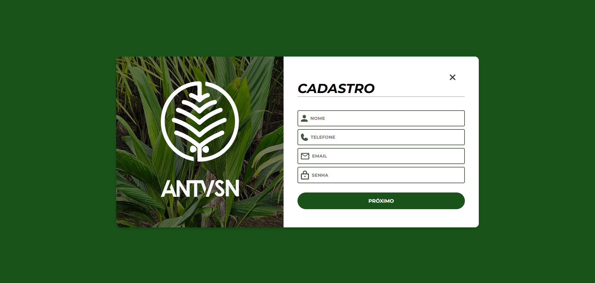
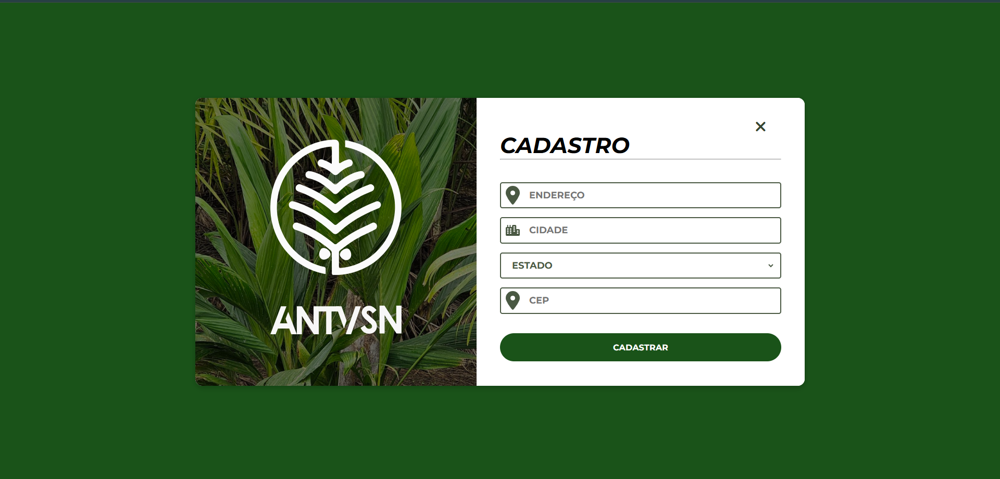
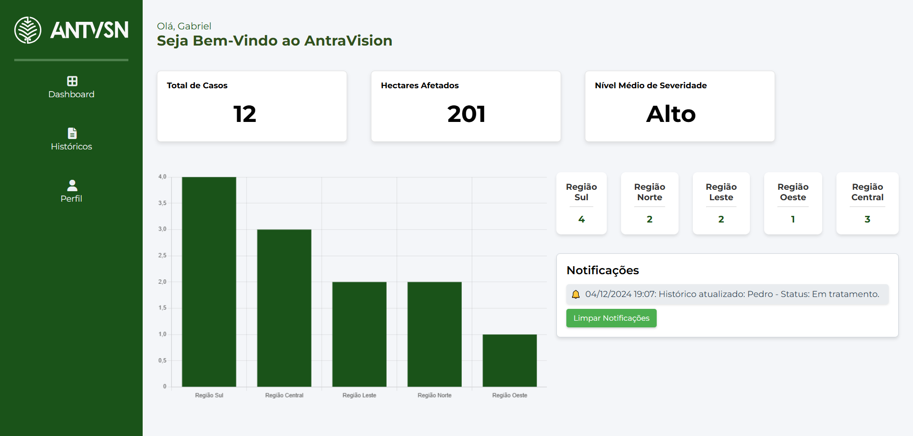

# 🌴 Projeto Integrador - Antravision

## Sobre o Projeto
En nosso Projeto denominado Antravision, possuimos como objetivo desenvolver um sistema integrado, composto por um aplicativo móvel e uma plataforma web, para identificar e gerenciar a antracnose em pupunheiras, utilizando Aprendizagem Profunda para diagnósticos rápidos e precisos.. Este repositório inclui a implementação de uma interface web, uma API e a configuração necessária para rodar o sistema.

## Funcionalidades
- Tela de Login / Cadastro

- Tela do Dashboard

- Tela do Histórico de Detecções

- Tela de Perfil

## Tecnologias Utilizadas
- *Frontend*: , , , )
- *Backend*: )
- *Banco de Dados*: )

## Como Instalar e Rodar o Projeto
1. Clone este repositório:
   bash
   git clone https://github.com/GabrielRodriguez153/Projeto_Integrador_V4.git
   
2. Navegue para o diretório do projeto:
   bash
   cd Projeto_Integrador_V4
   
3. Instale as dependências listadas no arquivo requirements.txt:
   bash
   pip install -r requirements.txt
   
4. Inicie o servidor:
   bash
   python run.py
   
5. Acesse a aplicação no navegador em http://localhost:4000.

## Estrutura do Projeto
- */api*: Contém o código referente à API.
- */web*: Inclui os arquivos da interface web (HTML, CSS, JS).
- *requirements.txt*: Lista de dependências Python necessárias.
- *README.md*: Documentação do projeto.

## Contribuições
Contribuições são bem-vindas! Para contribuir:
1. Realize um fork do repositório.
2. Crie uma branch para sua feature ou correção:
   bash
   git checkout -b minha-feature
   
3. Envie um pull request.

## Contato
- Gabriel Henrique Rodrigues de Salles
- Email para Contato : gabrodriguez153@gmail.com
