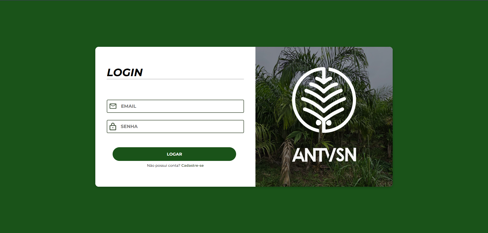
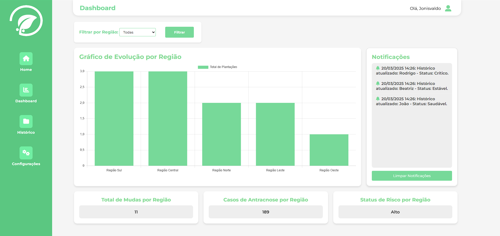
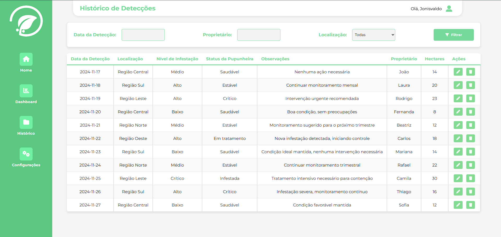
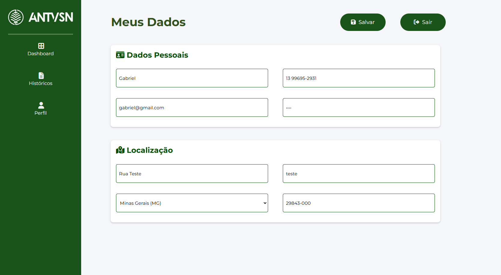

# 🌴 Projeto Integrador - Antravision V5

## Sobre o Projeto
Em nosso Projeto denominado Antravision, possuimos como objetivo desenvolver um sistema integrado, composto por um aplicativo móvel e uma plataforma web, para identificar e gerenciar a antracnose em pupunheiras, utilizando Aprendizagem Profunda para diagnósticos rápidos e precisos.. Este repositório inclui a implementação de uma interface web, uma API e a configuração necessária para rodar o sistema.

## Funcionalidades
- Telas de Login / Cadastro 1° e 2° Etapas

- Tela Principal

- Tela do Dashboard

- Tela do Histórico de Detecções

- Tela de Perfil

## Tecnologias Utilizadas
- *Frontend*: HTML, CSS, JavaScript e Python Flask
- *Backend*: Python
- *Banco de Dados*: MongoDB

## Como Instalar e Rodar o Projeto
1. Clone este repositório:
   bash
   git clone https://github.com/GabrielRodriguez153/Projeto_IntegradorV5.git
   
2. Navegue para o diretório do projeto:
   bash
   cd Projeto_IntegradorV5
   
3. Instale as dependências listadas no arquivo requirements.txt:
   bash
   pip install -r requirements.txt
   
4. Inicie o servidor:
   bash
   python run.py
   
5. Acesse a aplicação no navegador em http://localhost:4000.

## Estrutura do Projeto
- */api*: Contém o código referente à API.
- */front*: Inclui os arquivos da interface web (HTML, CSS, JS).
- *requirements.txt*: Lista de dependências Python necessárias.
- *README.md*: Documentação do projeto.

## Contribuições
Contribuições são bem-vindas! Para contribuir:
1. Realize um fork do repositório.
2. Crie uma branch para sua feature ou correção:
   bash
   git checkout -b minha-feature
   
3. Envie um pull request.

## Contato
- Gabriel Henrique Rodrigues de Salles
- Email para Contato : gabrodriguez153@gmail.com
